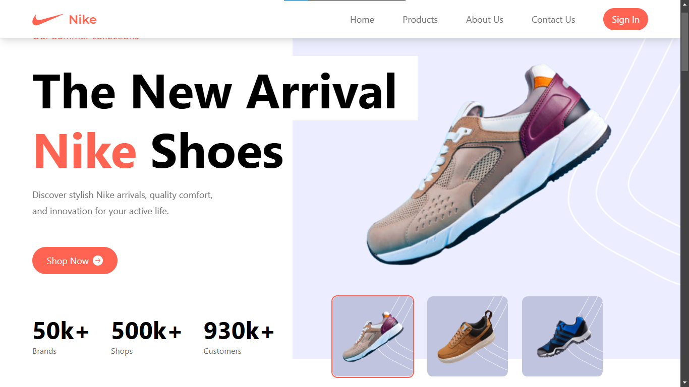

#  Nike Landing Page

## 🚀 Introduction

Welcome to Nike landing page! This website is a modern landing page inspired by Nike's iconic design. It showcasea a collection of atthletic Footwears. It is designed to inspire and empower athletes of all levels. This project aims to provide seamless browsing experience with a focus on high-quality visuals, intiutive navigation and a strong call to action.

## Features

### 📱💻 Fully Responsive Design

- Ensures a seamless experience across all devices, including desktops, tablets, and mobile phones.
- Uses **Tailwind CSS** for a flexible, mobile-first design.
- Optimized for fast performance and smooth animations.

### 🏄‍♀️🏄‍♂️ Interactive Elements:

- Engaging animations, transitions, and hover effects to enhance user interaction and create a dynamic browsing experience.

## 📱 Demo

- [Link to live demo https://nike-two-sandy.vercel.app/][View the live site on Vercel]

## Technologies Used

### Frontend

- [Framework: **React.js**]
- [Styling: **Tailwind CSS**]
- [React Carousel: **For slider animation**]
- [React AOS: **For scroll animation**]
- [Deployment: **Vercel**]

## Project structure

### Frontend

```
  ├── public/                     # Contains static files
  │   ├── assets                  # Images/ icons folder
  |       ├── icons               # Icons used in the websites
  |           ├── index           # Exports all icons files [makes it easy to import files]
  |       ├── images              # Images used in the websites
  |           ├── index           # Exports all image files [makes it easy to import files]
  ├── src/
  │   ├── components              # Contains reusable code in the app
  │       ├── Button.jsx          # Dynamic button. with props styling
  │       ├── Navbar.jsx          # Navbar for page navigation
  │       ├── Navbar.jsx          # Footer for external links
  │       ├── Cards.jsx           # Cards used in the main page
  │       ├── Index.js            # Exports all files in the component folder
  ├── Constant/
  │   ├── index.js                # Contains text, images, and values used across the apps [makes editing site content easier]
  ├── Context/
  │   ├── index.js                # Shares values between component without props driling [this is a global data for the app]
  ├── pages/
  │   ├── Home
  │       ├── Home.jsx            # Home page section
  │   ├── PopularProducts
  │       ├── PopularProducts.jsx # Products page with carousel to showcase each products
  │   ├── Review
  │       ├── Review.jsx          # Review page section displays past customers review
  │   ├── Service
  │       ├── Service.jsx         # Service page section with carousel to showcase Nike's premium services
  │   ├── SpecialOffer
  │       ├── SpecialOffer.jsx    # SpecialOffer page section
  │   ├── Subscribe
  │       ├── Subscribe.jsx       # Subscribe page section for getting news letter
  │   ├── SuperQuality
  │       ├── SuperQuality.jsx    # SuperQuality page section for displaying Nike's super quality products
  │   ├── Index.js                # Exports all files in the pages folder
  ├── App.jsx                     # Main React app component with app routes
  ├── index.css                   # Global styles
  ├── main.jsx                    # Entry point for React
  ├── .gitignore                  # Files that are ignored by git.
  ├── package-lock.json
  ├── package.json
  ├── postcss.config.js
  └── tailwind.config.js
```

## 📦 Dependencies

```
  "dependencies": {
    "aos": "^2.3.4",                            # Animate on scroll
    "react": "^18.3.1",                         # React framework
    "react-countup": "^6.5.3",                  # [Animate numbers based on values]
    "react-dom": "^18.3.1",                     # ReactDOM for rendering
    "react-intersection-observer": "^9.15.1",   # Detects screen viewport
    "react-slick": "^0.30.3",                   # Slider animation
    "slick-carousel": "^1.8.1"                  # For Carousel
  },
```

## Getting Started:

1.  **Clone the repository:** `git clone [https://github.com/Maarcbaz/Nike.git]`
2.  **Navigate to the project directory:** `cd [Nike]`
3.  **Install dependencies:** `npm install` [make sure you have node installed check the node installed `node -v`]
4.  **Run the development server:** `npm start`
5.  **Open your browser and visit [Local Development URL, `http://http://localhost:5173/`]**

## Customization:

• **Styling:** Modify the Tailwind CSS from each react page to customize the look and feel of the website.

• **Content:** Update the product data in the `src/Constant/ndex.js` directory to showcase your own collection.

• **Content:** Update Images in the `public/assets` directory to showcase your own collection.

• **Components:** Extend or modify the existing React components in the `src/components` directory to add new features or customize the functionality of the website.

• **Pages:** Extend or modify the existing React Pges in the `src/pages` directory to add new features or customize the functionality of the website.

## Contributing:

We welcome contributions!

## Acknowledgments

• Inspired by Nike's exceptional website design and user experience.
• [Used images from Nike home page, unsplash]

## 📱 Demo

- [Link to live demo https://nike-two-sandy.vercel.app/][View the live site on Vercel]
